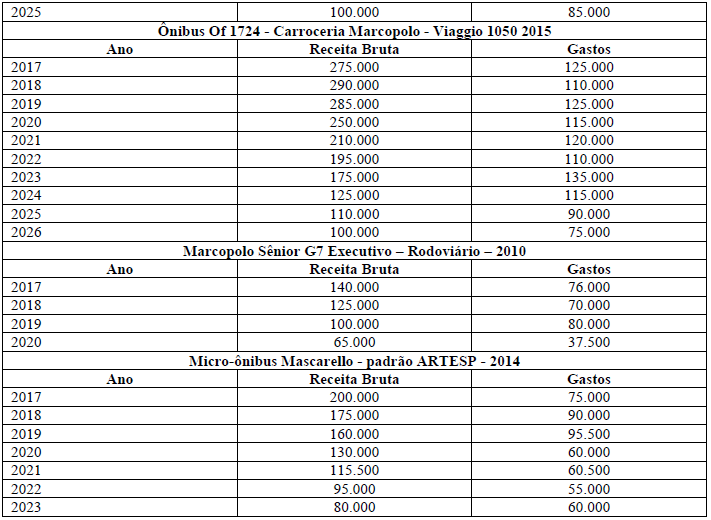

# App_Aula_Impairment
Aplicativo interativo para usar nas aulas de Impairment de Ativos

# 1 - Sobre o aplicativo,      
 - Aplicativo para complementação de explicações em sala de aula sobre o tema "*Impairment* de Ativos"       
 - O aplicativo também tem aplicações em aulas sobre "Redução ao Valor Recuperável de Ativos" e temas correlatos.     
 - O desenvolvimento desse aplicativo usou como base o exercício **Estudo de Caso 1** da lista de exercícios 1/2018 do professor Ms. Geovane Camilo do Santos (PUC-GO).            
	- O enunciado do aplicativo, as tabelas e o procedimento para acessar as resoluções estão descritos na seção 3.         
 - Aplicativo escrito e desenvolvido por Eduardo Alvim ([dualvim](https://github.com/dualvim/) )     
	- Linguagem de desenvolvimento: R (Utilizando os recursos do *R Package* 'Shiny', desenvolvido pela RStudio)      
	- Todo o código do aplicativo está disponível no repositorio do autor (dualvim), no seguinte endereço: [https://github.com/dualvim/](https://github.com/dualvim/)
	- **(Obs: Fazer Upload do código)**         
      

# 2 - *Inputs* com valores ajustáveis e *outputs* retornados:    
 - Valores ajustáveis no menu lateral:       
	- Data do balanço    
	- Data da compra do(s) ativo(s)     
	- Preço de compra (unitário) do(s) ativos(s)      
	- Quantidade de ativos adquiridos     
	- Vida útil do(s) ativo(s)     
	- Percentual do valor residual    
	- Taxa de desconto dos fluxos de caixa líquidos (usado para calcular o valor residual)     
	- Preço de venda (valor de mercado), unitário, do ativo analisado     
	- 10 campos para inserir valores para as receitas esperadas futuras do ativo (aba "Receitas")      
	- 10 campos para inserir valores para os gastos esperadas futuras do ativo (aba "Gastos")     
       
 
 - Valores calculados apresentados na aba **"Valor Contábil"**:      
	- Valor total do(s) ativo(s) analisado(s)     
	- Valor residual do(s) ativo(s)         
	- Valor Depreciável do(s) ativo(s)        
	- Depreciação acumulada do ativo entre a data da compra e a data do balanço      
	- Valor contábil do ativo na data do balanço       
	

 - Valores calculados apresentados na aba **"Valor em Uso"**:       
	- Valor em uso do ativo     
	- Equação com o cálculo detalhado do valor em uso     
           

 - Valores calculados apresentados na aba **"Valor Recuperável e Impairment"**:       
	- Valor em uso do(s) ativo(s)        
	- Valor de mercado do(s) ativo(s)      
	- Valor recuperável do(s) ativo(s)        
	- Valor da perda a reconhecer no valor do(s) ativo(s)         
        

 - Gráficos e tabelas gerados:       
	- Aba "Valor Contábil":     
		- Gráfico com uma barra indicando graficamente quanto do valor depreciável já foi apropriado no valor contábil do ativo       
	- Aba "Valor em Uso":      
		- Gráfico com um diagrama de fluxos de caixa com as receitas, gastos e fluxos de caixa líquidos      
		- Tabela Com os valores das receitas, gastos, fluxos de caixa líquidos e valor presente dos fluxos de caixa líquidos     
	- Aba "Valor Recuperável e *Impairment*":      
		- Gráfico de barras indicando o valor em uso,, o valor de mercado e o valor contábil do ativo analisado.     
            

# 3 - Exercício base do aplicativo:       
 - Estudo de Caso 1 da lista de exercícios 1/2018    
 - Autor: **prof. Ms. Geovane Camilo dos Santos**      
 - Afiliação: "Escola de Gestão e Negócios" - Pontifícia Universidade Católica - GO                        
         
	 
## 3.1 - Enunciado do exercício:
 - A empresa Transporte com Segurança Ltda., criada em 23 de março de 2005 é especializada em transporte de passageiros em ônibus para excursões em todo o país. A organização empresarial utiliza em sua operação 5 ônibus grandes e 3 micro ônibus.       
 - Todos os veículos foram comprados novos.    
 - A seguir são apresentados os dados de cada um dos ônibus listados no ativo imobilizado da empresa.             
       

Ativo |	Valor Compra |	Residual | Quantidade |	Data Compra | Vida Útil | Valor Venda
----- | ----- | ----- | ----- | ----- | ----- | -----
Marcopolo Paradiso Ld G7 Scania Ano 2014/2014 | R$ 950.000 | 15% | 2 | 26/05/2014 | 7 | R$ 680.000
Dd Comil Campione 2015/2016 | R$ 850.000 | 12% | 2 | 04/01/2016 | 10 | R$ 755.000
Ônibus Of 1724 - Carroceria Marcopolo - Viaggio 1050 2015 | R$ 620.000 | 20% | 1 | 02/07/2016 | 10 | R$ 490.000
Marcopolo Sênior G7 Executivo <U+0096> Rodoviário 2010 | R$ 345.000 | 15% | 2 | 02/06/2010 | 10 | R$ 138.500
Micro-ônibus Mascarello - padrão ARTESP - 2014 | R$ 400.000 | 6% | 1 | 24/10/2014 | 9 | R$ 255.000

 - Já as receitas e gastos esperados até o fim da vida útil de cada um dos ônibus acima estão apresentados nas tabelas a seguir.      
                
                 
           

 - Considerando a data de balanço 31/12/2016 e uma taxa de retorno esperada de 17,0% a.a., para cada um dos ativos acima, identifique se há necessidade de se reconhecer *impairment* e, em caso afirmativo, identifique também o valor das perdas a serem reconhecidas.        
	
	
## 3.2 - Respostas das questçoes do estudo de caso:      
 - Na aba **"Dados Imobilizado"**, no menu lateral com os campos para selecionar os valores dos *inputs* da análise, o primeiro campo (Nome do Ativo), é uma lista suspensa com os nomes de cada um dos ativos analisados no exercício.      
 - Ao selecionar um dos ativos dessa lista, o aplicativo irá definir automaticamente os valores de todos os campos do menu lateral com os *inputs* e o painel principal irá apresentar todos os *outputs* calculados para o exercício.       
 - Após a selecionar um dos ativos da lista suspensa, o usuário poderá modificar sem problema algum os valores dos *inputs* no menu lateral e, com isso, continuar recebendo as soluções de versões alternativas do exercício.     
           
